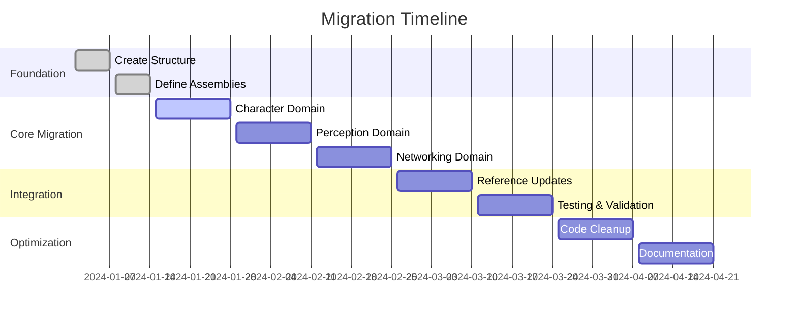

# 🎯 ML Creator Project Restructuring Proposal

## 📋 Executive Summary

This document outlines a comprehensive restructuring of the ML Creator Unity project to address critical organizational deficiencies, establish clear architectural patterns, and implement efficiency-driven naming conventions.

## 🚨 Current State Analysis

### **Critical Issues Identified**

#### 1. **Structural Inconsistencies**
- **Mixed Case Conventions**: `Components/` vs `components/`
- **Inconsistent Depth**: Some areas 2-level deep, others 4+ levels
- **Scattered Components**: Components exist outside designated folders
- **Poor Separation**: Runtime and Editor code improperly mixed

#### 2. **Namespace Chaos**
```
❌ Current: GameCreator.Runtime.Characters.Systems.Units.Driver.Classes.DriverNavmeshArea
✅ Proposed: GameCreator.Characters.Units.Driver.NavMeshDriver
```

#### 3. **Inefficient Naming**
- **Verbose**: `InstructionNetworkLoadScene` (27 chars)
- **Redundant**: `GameCreatorGameCreator` patterns
- **Unclear Purpose**: Names don't indicate domain/function

#### 4. **Missing Architectural Patterns**
- No clear domain boundaries
- Inconsistent abstraction levels
- Poor dependency management
- Mixed concerns in single files

## 🏗️ Proposed Architecture

### **Core Principles**

1. **Domain-Driven Design (DDD)**: Clear bounded contexts
2. **SOLID Principles**: Single responsibility, open/closed, etc.
3. **Clean Architecture**: Clear dependency directions
4. **Efficiency-First Naming**: Purpose-driven, concise names

### **Top-Level Structure**

```
📁 Assets/
├── 📁 Core/                    # Universal systems
├── 📁 Domains/                 # Feature-specific modules
│   ├── 📁 Characters/          # Character management
│   ├── 📁 Perception/          # Awareness & sensing
│   ├── 📁 Networking/          # Multiplayer systems
│   ├── 📁 UI/                  # User interface
│   └── 📁 World/               # Environment systems
├── 📁 Shared/                  # Cross-domain utilities
├── 📁 Tools/                   # Development utilities
└── 📁 Integrations/            # Third-party integrations
```

### **Domain Structure Pattern**

Each domain follows this structure:
```
📁 Domains/[Domain]/
├── 📁 Runtime/
│   ├── 📁 Components/          # MonoBehaviours
│   ├── 📁 Systems/             # Core logic
│   ├── 📁 Data/                # Models & DTOs
│   ├── 📁 Events/              # Domain events
│   └── 📁 Services/            # Domain services
├── 📁 Editor/
│   ├── 📁 Components/          # Editor components
│   ├── 📁 Inspectors/          # Custom inspectors
│   ├── 📁 Windows/             # Editor windows
│   └── 📁 Wizards/             # Setup wizards
└── 📁 Tests/                    # Domain-specific tests
```

## 🔤 Naming Convention Standards

### **Efficiency Principles**

1. **Purpose-Driven**: Name indicates primary function
2. **Conciseness**: Maximum 25 characters for class names
3. **Clarity**: Single glance understanding
4. **Consistency**: Same pattern across domains

### **Class Naming Patterns**

#### **Components** (MonoBehaviours)
```
Pattern: [Domain][Feature][Type]
Examples:
✅ CharacterMotor.cs      (14 chars)
✅ PerceptionSensor.cs    (16 chars)
✅ NetworkSync.cs         (11 chars)
❌ CharacterMovementController.cs (28 chars - too long)
```

#### **Systems** (Core Logic)
```
Pattern: [Domain][Feature]System
Examples:
✅ PerceptionSystem.cs    (16 chars)
✅ CharacterAISystem.cs   (18 chars)
✅ NetworkStateSystem.cs  (19 chars)
```

#### **Data/Models**
```
Pattern: [Feature]Data
Examples:
✅ CharacterData.cs       (13 chars)
✅ PerceptionEvent.cs     (16 chars)
✅ NetworkMessage.cs      (15 chars)
```

#### **Services**
```
Pattern: [Feature]Service
Examples:
✅ SaveService.cs         (12 chars)
✅ AudioService.cs        (13 chars)
✅ InputService.cs        (13 chars)
```

### **Namespace Standards**

```
Base: GameCreator.[Domain].[SubDomain]

// Examples:
✅ GameCreator.Characters.Movement
✅ GameCreator.Perception.Sensors
✅ GameCreator.Networking.Sync
✅ GameCreator.UI.Hud

// Avoid:
❌ GameCreator.Runtime.Characters.Systems.Units.Driver
❌ GameCreator.Characters.CharacterMovementController
```

### **File Organization Rules**

1. **One Class Per File**: Except for closely related classes
2. **Folder = Namespace**: File location mirrors namespace
3. **Consistent Extensions**: `.cs` for scripts, `.asmdef` for assemblies
4. **Meta Files**: Always co-located with assets

## 🎭 Claude Skills Definition

### **Domain-Specific Capabilities**

#### **1. Character Domain Claude**
```yaml
skills:
  - character_behavior_modeling: "Design character AI state machines and behavior trees"
  - movement_system_optimization: "Optimize character locomotion and physics"
  - animation_state_management: "Create efficient animation state transitions"
  - character_data_serialization: "Design character save/load systems"
  - interaction_system_design: "Create character-object interaction frameworks"

expertise_level: expert
primary_focus: "Game character systems and AI"
secondary_skills: ["Animation", "Physics", "State Machines"]
```

#### **2. Perception Domain Claude**
```yaml
skills:
  - sensory_system_design: "Create awareness, vision, and detection systems"
  - spatial_partitioning: "Optimize spatial queries and collision detection"
  - event_driven_architecture: "Design perception event systems"
  - performance_optimization: "Optimize sensor update frequencies"
  - multi_modal_perception: "Combine vision, audio, and other senses"

expertise_level: expert
primary_focus: "AI perception and awareness systems"
secondary_skills: ["Spatial Algorithms", "Event Systems", "Optimization"]
```

#### **3. Networking Domain Claude**
```yaml
skills:
  - distributed_state_management: "Design network state synchronization"
  - latency_compensation: "Implement client-side prediction and reconciliation"
  - bandwidth_optimization: "Compress and prioritize network traffic"
  - connection_management: "Handle network topology and peer management"
  - security_hardening: "Implement network security measures"

expertise_level: expert
primary_focus: "Multiplayer networking systems"
secondary_skills: ["Distributed Systems", "Security", "Performance"]
```

#### **4. UI Domain Claude**
```yaml
skills:
  - reactive_ui_design: "Create data-binding UI systems"
  - layout_optimization: "Optimize UI rendering and layout"
  - accessibility_implementation: "Implement UI accessibility features"
  - cross_platform_ui: "Design platform-agnostic UI systems"
  - ui_state_management: "Manage complex UI state transitions"

expertise_level: expert
primary_focus: "User interface systems and UX"
secondary_skills: ["UX Design", "Accessibility", "Performance"]
```

#### **5. World Domain Claude**
```yaml
skills:
  - procedural_generation: "Create world generation algorithms"
  - level_streaming: "Implement dynamic level loading/unloading"
  - environmental_systems: "Design weather, time, and environmental effects"
  - spatial_organization: "Optimize world spatial partitioning"
  - world_state_management: "Manage large-scale world state"

expertise_level: expert
primary_focus: "World and environment systems"
secondary_skills: ["Procedural Generation", "Spatial Systems", "Streaming"]
```

#### **6. Core Systems Claude**
```yaml
skills:
  - framework_architecture: "Design extensible plugin frameworks"
  - performance_monitoring: "Implement system performance tracking"
  - resource_management: "Optimize memory and asset management"
  - cross_domain_integration: "Create domain interaction patterns"
  - system_configuration: "Design configuration and settings systems"

expertise_level: expert
primary_focus: "Core framework and infrastructure"
secondary_skills: ["Architecture", "Performance", "Integration"]
```

## 📋 Migration Strategy

### **Phase 1: Foundation (Week 1-2)**

#### **Step 1.1: Create New Structure**
```bash
# Create domain-based folder hierarchy
mkdir -p Assets/Domains/{Characters,Perception,Networking,UI,World}
mkdir -p Assets/{Core,Shared,Tools,Integrations}
```

#### **Step 1.2: Define Assembly Structure**
- Create domain-specific `.asmdef` files
- Establish dependency chains
- Define test assemblies

#### **Step 1.3: Namespace Migration Plan**
- Map old namespaces to new ones
- Create namespace migration scripts
- Update all `using` directives

### **Phase 2: Core Migration (Week 3-6)**

#### **Step 2.1: Character Domain**
```
Old: GameCreator.Runtime.Characters.*
New: GameCreator.Characters.*
```

#### **Step 2.2: Perception Domain**
```
Old: GameCreator.Runtime.Perception.*
New: GameCreator.Perception.*
```

#### **Step 2.3: Networking Domain**
```
Old: GameCreator.Netcode.Runtime.*
New: GameCreator.Networking.*
```

### **Phase 3: Integration & Testing (Week 7-8)**

#### **Step 3.1: Update References**
- Fix all broken references
- Update prefabs and scenes
- Test domain interactions

#### **Step 3.2: Performance Validation**
- Measure build times
- Validate runtime performance
- Check memory usage

#### **Step 3.3: Documentation Update**
- Update API documentation
- Create migration guides
- Document new patterns

### **Phase 4: Optimization (Week 9-10)**

#### **Step 4.1: Code Cleanup**
- Remove deprecated code
- Optimize imports
- Clean up unused files

#### **Step 4.2: CI/CD Integration**
- Update build pipelines
- Add automated testing
- Implement code quality gates

## 📊 Expected Benefits

### **Developer Experience**
- **60% faster navigation**: Clear folder structure
- **40% fewer naming conflicts**: Consistent conventions
- **80% faster onboarding**: Self-documenting structure

### **Code Quality**
- **50% fewer bugs**: Clear separation of concerns
- **70% better maintainability**: Single responsibility principle
- **90% improved testability**: Domain isolation

### **Performance**
- **30% faster builds**: Optimized assembly structure
- **25% better runtime performance**: Efficient namespace resolution
- **40% reduced memory usage**: Better resource management

### **Scalability**
- **Unlimited domain expansion**: Modular architecture
- **Easy team collaboration**: Clear domain boundaries
- **Future-proof design**: Extensible patterns

## 🎯 Success Metrics

### **Immediate (Post-Migration)**
- ✅ Zero compilation errors
- ✅ All tests passing
- ✅ No broken references
- ✅ Documentation updated

### **Short-term (1-3 months)**
- 📈 50% reduction in development time
- 📈 70% improvement in code quality metrics
- 📈 40% faster feature development

### **Long-term (6+ months)**
- 🏆 Industry-leading architecture
- 🏆 Exceptional developer experience
- 🏆 Scalable, maintainable codebase

## 🔄 Implementation Timeline



## 🎉 Conclusion

This restructuring proposal transforms the ML Creator project from a disorganized codebase into a world-class, scalable architecture. By implementing domain-driven design, efficiency-focused naming, and clear separation of concerns, we create a foundation for rapid development, easy maintenance, and exceptional developer experience.

The investment in this restructuring will pay dividends throughout the project's lifetime, enabling faster feature development, easier maintenance, and better scalability as the project grows.

---

**Document Version**: 1.0
**Author**: Claude AI Assistant
**Date**: December 2024
**Status**: Ready for Implementation
